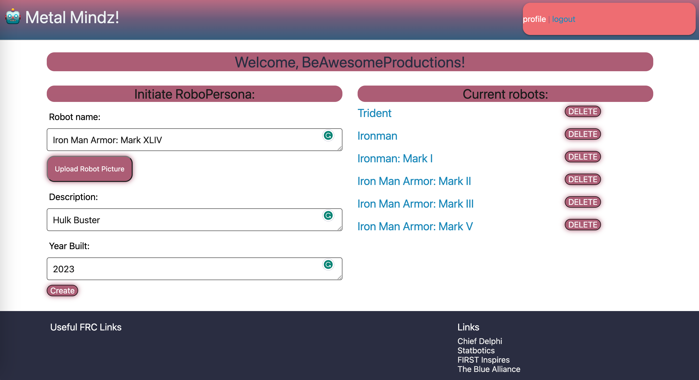

# MetalMindz

## Description

 MetalMindz is a social app for FRC robot builders. Show off your creations, connect with others, and get inspired. Simply create a profile, upload photos of your robots, and join a community of like-minded enthusiasts.

## Table of Contents

- [Usage](#usage)
- [Demo](#demo)
- [Screenshots](#screenshots)
- [Contributing](#contributing)
- [questions](#questions)
- [License](#license)
- [credits](#credits)

## Usage

To use this app, simply create a profile , upload photos of your robots, and join a community of like-minded enthusiasts.

## Demo

Here is the link to the deployed app: [MetalMindz](https://metal-mindz.herokuapp.com/)

## Screenshots

## Contributing

Contributions are welcome. Please open an issue or pull request to discuss potential changes/additions.

## Questions

- Our GitHub Repo is [MetalMindz](https://github.com/mynamebrogrammer/MetalMindz)

## License

This project is licensed under the MIT license. 

## Credits

- This project was a collaboration of the minds of Habib Maksoud, Kevin Oshea, and Tyler Gosley

[Node.js](https://nodejs.org/en/docs)

[Express.js](https://expressjs.com/en/guide/routing.html#express-router)

[Handlebars.js](https://handlebarsjs.com/guide/#what-is-handlebars)

[MySQL](https://dev.mysql.com/doc/mysql-getting-started/en/)

[Sequelize](https://sequelize.org/)

[Heroku](https://devcenter.heroku.com/categories/reference)

[Codecademy](https://www.codecademy.com/learn)

[Khan Academy](https://www.khanacademy.org/)

[MDN Docs](https://developer.mozilla.org/en-US/)

[W3Schools](https://www.w3schools.com/js/default.asp)

[JavaScript.info](https://javascript.info/)

[CodeHS](https://codehs.com/)